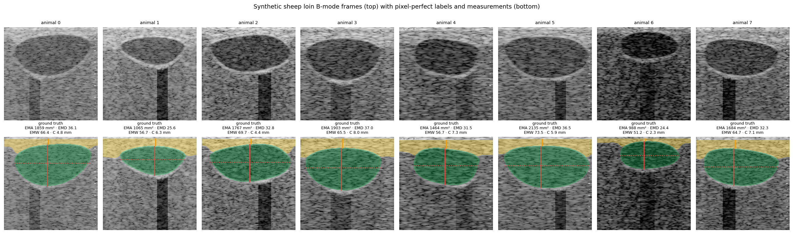
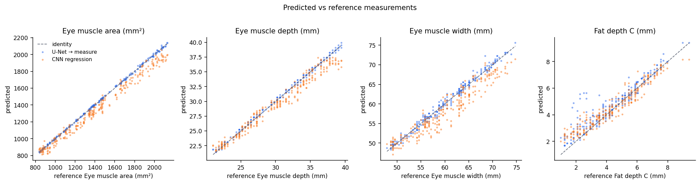
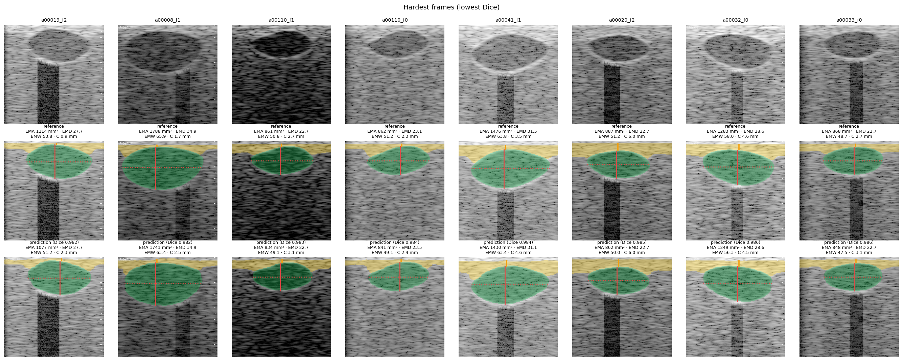
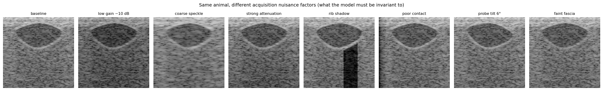

# Computer Vision for Ultrasound Measurement

**`cvmeasure`** — a PyTorch pipeline that turns a B-mode ultrasound frame into physical
measurements: a U-Net segments the anatomy, the mask is measured geometrically in
millimetres, QC flags catch unusable frames, and agreement with reference values is reported
with method-comparison statistics (bias, MAE, Lin's CCC, Bland-Altman). Because annotated
ultrasound is scarce, the repository also includes a **physics-inspired synthetic B-mode
simulator** with pixel-perfect labels, a domain-shift stress test, a direct-regression CNN
baseline, and a LabelMe / COCO importer so real annotated frames train with the same code.

**Worked example:** sheep loin scans — eye muscle area / depth / width and fat depth C, the
traits ram-breeding programmes measure by ultrasound. Everything below is that case study;
the pipeline itself does not care what the organ is.

> Personal research prototype. All numbers are on synthetic data — see the
> [model card](docs/02-model-card.md) for what that does and does not tell you.



## What it demonstrates

| Skill | Where |
|---|---|
| CNN image segmentation (U-Net from scratch; optional ImageNet-pretrained ResNet-18 encoder), Dice + CE loss | `src/cvmeasure/models/unet.py` |
| Direct-regression CNN baseline and a reasoned comparison of the two approaches | `src/cvmeasure/models/regressor.py`, `docs/03-results.md` |
| Image synthesis from first principles: speckle via PSF convolution, incidence-angle-dependent specular boundaries, attenuation, acoustic shadow, probe-contact loss | `src/cvmeasure/synth/generator.py` |
| Dataset engineering: by-animal splits, label-consistent augmentation, annotation import (LabelMe / COCO), pixel-spacing calibration | `src/cvmeasure/data/` |
| Geometry from masks → millimetre measurements with QC flags | `src/cvmeasure/measure/measurements.py` |
| Validation the way method-comparison studies do it: Dice/IoU, bias, MAE, RMSE, R², Lin's CCC, Bland-Altman limits of agreement; domain-shift set; low-data ablation | `src/cvmeasure/metrics.py`, `reports/` |
| Reproducible engineering: configs, seeds, checkpoints with embedded config, pytest, ruff, GitHub Actions CI with an end-to-end smoke run | `configs/`, `tests/`, `.github/workflows/ci.yml` |

## The case study

Ram-breeding programmes in New Zealand select on eye-muscle and fat traits measured on the
live animal by ultrasound at the 12th/13th rib; a technician traces the muscle by hand on a
frozen frame, which is slow and operator-dependent. I wanted to see how far a
segment-then-measure pipeline can be pushed for this, and what it takes to validate it
properly. Domain background, measurement conventions and sources: [docs/01-domain-research.md](docs/01-domain-research.md).

## What is in the box

```
src/cvmeasure/
  synth/generator.py      physics-inspired B-mode simulator (speckle PSF, incidence-angle specular
                          boundaries, attenuation, rib shadow, contact loss, console burn-in) with
                          pixel-perfect masks and true mm measurements
  data/dataset.py         on-disk dataset, by-animal splits, ultrasound-appropriate augmentation
  data/annotation.py      LabelMe / COCO polygon import for REAL annotated frames (+ mm/px handling)
  models/unet.py          U-Net (1.9 M params) + optional ResNet-18-encoder U-Net; Dice+CE loss
  models/regressor.py     direct-regression CNN baseline (image -> 4 numbers)
  measure/measurements.py mask -> EMA / EMD / EMW / fat C in mm, with QC flags
  metrics.py              Dice/IoU, bias, MAE, RMSE, R², Lin's CCC, Bland-Altman LoA
  train.py / evaluate.py / predict.py   CLIs
scripts/                  make_dataset.py, make_figures.py
configs/                  default.yaml (full run), smoke.yaml (CI, 1 min)
tests/                    pytest unit tests (geometry, generator, models, importer, metrics)
docs/                     01 domain research (sheep case study) · 02 model card · 03 results · 04 design notes
reports/                  metrics.json, per-frame CSV and figures for test + domain-shift sets
notebooks/                walkthrough notebook
```

## Results of the case study (synthetic test sets)

Full tables, figures and discussion: [docs/03-results.md](docs/03-results.md).

| Test set | Dice muscle | EMA MAE (mm²) | EMD MAE (mm) | EMW MAE (mm) | Fat C MAE (mm) | EMA CCC |
|---|---|---|---|---|---|---|
| In-distribution test (n=264), U-Net → measure | **0.994** | **6.9** | **0.13** | **0.58** | 0.41 | 1.000 |
| In-distribution test, CNN direct regression | – | 69.0 | 0.84 | 2.11 | 0.41 | 0.976 |
| Domain-shift set (n=241), U-Net → measure | **0.992** | **13.2** | **0.15** | **0.69** | 0.43 | 0.999 |
| Domain-shift set, CNN direct regression | – | 80.6 | 0.88 | 2.58 | 0.51 | 0.962 |
| Low-data ablation (10 % of animals), test | 0.980 | 21.5 | 0.31 | 1.82 | 1.09 | 0.997 |

Segment-then-measure beats direct regression 4-10× on muscle traits and degrades gracefully
under scanner-setting shift; fat depth C is the hard trait for both (CCC ≈ 0.93). QC flags
("muscle cut off by field of view") agree with ground truth on ≥97.5 % of frames.





## Quick start

```bash
pip install torch torchvision --index-url https://download.pytorch.org/whl/cpu   # or a CUDA build
pip install -e ".[dev]"

python scripts/make_dataset.py                       # ~2 min: 1 795 train/val/test frames + 241 domain-shift frames
python -m cvmeasure.train --task seg                  # U-Net, 12 epochs (~35 min on 2 CPU cores, minutes on GPU)
python -m cvmeasure.train --task reg --epochs 20      # regression baseline
python -m cvmeasure.evaluate --seg runs/seg/best.pt --reg runs/reg/best.pt --data data/synthetic       --out reports/test
python -m cvmeasure.evaluate --seg runs/seg/best.pt --reg runs/reg/best.pt --data data/synthetic_shift --out reports/shift
python -m cvmeasure.predict  --seg runs/seg/best.pt --images data/synthetic_shift/images --pixel-spacing 0.42 --out predictions --limit 12
python -m cvmeasure.train --task seg --config configs/lowdata_10pct.yaml   # low-data ablation
python scripts/make_figures.py
pytest -q
```

Pretrained synthetic-data checkpoints are included: `weights/unet_synthetic_v0.1.pt` (U-Net) and
`weights/regressor_synthetic_v0.1.pt` (+ `regressor_target_stats.json`), so `evaluate` / `predict`
work without retraining, e.g.
`python -m cvmeasure.predict --seg weights/unet_synthetic_v0.1.pt --images <folder> --pixel-spacing 0.42 --out predictions`.

### Using real annotated frames

```python
from cvmeasure.data.annotation import import_labelme
import_labelme("raw_frames/", "data/real", pixel_spacing_mm=0.10)   # mm/px from the scanner depth setting
# then point configs/default.yaml -> data.root: data/real and train as above (optionally seg_model.name: resnet18_unet)
```
Label names containing "muscle"/"eye"/"loin" → class 1, "fat"/"subcut" → class 2. Splits are
assigned by animal id (`<animal>_<frame>.png` naming by default).

## Method in one paragraph

Frames are 192×192 grayscale. The U-Net (base 16, depth 4, Dice+CE loss, AdamW + one-cycle
LR, 12 epochs) predicts background / eye muscle / subcutaneous fat. The predicted muscle mask
is cleaned (largest component, hole fill) and measured geometrically: EMA = pixel count ×
(mm/px)², EMW = lateral extent, EMD = maximal per-column extent, fat C = fat thickness in a
5-column window above the deepest muscle column. QC flags mark frames where the muscle
touches the image border or no muscle is found. Agreement with reference values is reported
as bias, MAE, RMSE, R², Lin's concordance correlation and Bland-Altman limits of agreement,
on an in-distribution test split and on a harder domain-shift set (lower gain, coarser
speckle, more shadowing / contact loss). A direct-regression CNN is trained on the same data
as a baseline.

## Scope and limitations

* Everything numerical here is on **synthetic** data. The simulator captures the main
  physics but the synthetic-to-real gap is real; results are evidence of *method*, not of
  accuracy on live animals.
* No data from any scanning service, breeder or commercial product were used or seen.
* Anatomy priors are plausible hand-set ranges for lambs at scanning weight.

## Author

Lillian Lee · lillian00lee@gmail.com · MIT licence.
